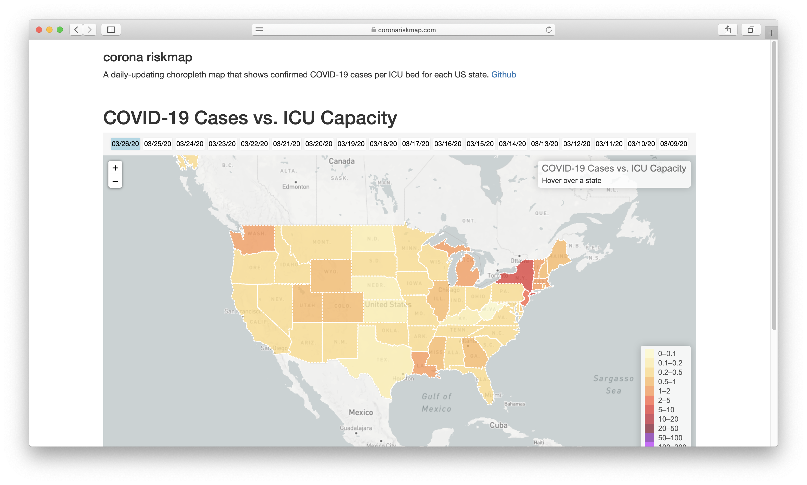

# COVID-19 cases vs. ICU capacity map

A daily-updating cloropleth map that shows confirmed COVID-19 cases per intensive-care bed for each US state.

### Sources
Hospital stats from [Modern Healthcare](https://www.modernhealthcare.com/hospitals/covid-19-could-fill-hospital-beds-how-many-are-there)

Daily COVID-19 data from [CSSE](https://github.com/CSSEGISandData/COVID-19)

## Installation
Installation is pretty simple. Clone the repo, setup a virtualenv, then install python dependencies

`pip install -r requirements.txt`

Next, run the scraper with the following sample command:

`python -m app.cli scrape`

which will scrape COVID-19 data, aggregate it with hospital stats, and generate a geometry data file for Mapbox.
This will then be displayed as a map when the user views the website.

Once you've scraped the data, go ahead and start the flask server, which resides in the run.py file.

### Configuration
The following vars need to be put in a `config.py` file inside an `instance` dir in the root of the repo. 

- `SENTRY_DSN`: A DSN for Sentry. If provided, Sentry error reporting is setup.

An example would look like this
```python
# A DSN for sentry. If provided, sentry error reporting is set up.
SENTRY_DSN = "123123@sentry.io/32423432"
```

### Daily Update
Add the contents of the [cron.txt](cron.txt) file to your crontab to activate daily running of the scraper.
This will run the scraper at 12:00am every day (CSSE updates their data daily at 11:59pm).

## Website


Once the server is up and running, this is what users see.
